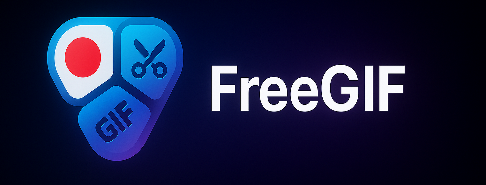

一个基于 Electron 的免费 GIF 屏幕录制和编辑工具。

操作演示：https://www.bilibili.com/video/BV1bU43zYE7m

简体中文 | [English](README_EN.md)

## ✨ 功能特性

- 📹 **屏幕录制** - 选择任意区域进行录制，支持多帧率选择（5-30 FPS）
- 🎬 **实时预览** - 录制前实时预览，录制时可查看内容
- ✂️ **帧裁剪** - 精确裁剪 GIF 的开始和结束帧
- ⚙️ **播放控制** - 支持播放/暂停、逐帧查看、速度调节（0.5x-2x）
- 🎨 **质量控制** - 多档质量预设，支持自定义抖动、调色板、分辨率
- 📁 **导入编辑** - 导入现有 GIF 文件进行二次编辑
- 💾 **快速导出** - 一键导出，实时显示编码进度
- 🎯 **统一界面** - 录制和编辑在同一窗口完成
- 🔄 **懒加载优化** - 帧图片按需加载，秒进编辑模式
- 📊 **文件大小预估** - 实时预览导出文件大小

## 📦 下载安装

### 方式 1：直接下载

- **Windows**:https://github.com/zstar1003/FreeGIF/releases/download/v1.0.0/FreeGIF.Setup.1.0.0.exe

### 方式 2：从源码运行

```bash
# 克隆项目
git clone https://github.com/zstar1003/FreeGIF.git
cd FreeGIF

# 安装依赖
npm install

# 启动应用
npm start
```

### 方式 3：本地构建

```bash
# 安装依赖
npm install

# 构建 Windows 版本
npm run build:win

# 构建 macOS 版本
npm run build:mac

# 构建所有平台
npm run build
```

构建产物会输出到 `dist` 目录。

## 🎮 使用方法

### 录制 GIF

1. 启动应用，点击 **"📹 开始录制"** 按钮
2. 使用鼠标拖动选择要录制的区域
3. 选择帧率（5-30 FPS，默认 10 FPS）
4. 点击 **"开始录制"** 开始录制（可实时预览）
5. 点击 **"停止录制"** 结束录制
6. 自动切换到编辑模式

### 编辑 GIF

录制完成后自动进入编辑模式：

#### 播放控制

- **播放/暂停** - 预览 GIF 效果
- **上一帧/下一帧** - 逐帧精确查看
- **速度调节** - 0.5x、1x、2x 播放速度
- **循环播放** - 开关循环播放模式
- **时间轴** - 点击帧号快速跳转

#### 编辑功能

- **裁剪帧** - 设置开始帧和结束帧，删除不需要的部分
- **质量预设** - 高质量、标准质量、压缩优先三档
- **高级设置**：
  - 输出分辨率（25%-100%）
  - 颜色采样质量（1%-100%）
  - 抖动处理（关闭/简化/Floyd-Steinberg/Stucki/Atkinson）
  - 调色板模式（局部/全局）

#### 信息显示

- 当前帧 / 总帧数
- 画面分辨率
- 预计文件大小

### 导入 GIF

1. 点击 **"📁 导入 GIF"** 按钮
2. 选择本地 GIF 文件
3. 等待解析完成，进入编辑模式

### 导出 GIF

1. 完成编辑后，点击 **"💾 导出 GIF"** 按钮
2. 选择保存位置和文件名
3. 等待编码完成（显示实时进度）
4. 导出成功提示

## 📂 项目结构

```
FreeGIF/
├── .github/
│   └── workflows/
│       ├── build.yml           # GitHub Actions CI/CD 配置
│       └── README.md           # CI/CD 说明文档
├── Assets/                     # 资源文件
│   └── logo.png
├── src/
│   ├── main.js                 # Electron 主进程
│   ├── public/
│   │   └── logo.ico            # 应用图标
│   └── renderer/               # 渲染进程
│       ├── recorder.html       # 主界面（录制+编辑）
│       ├── recorder.js         # 录制和编辑逻辑
│       ├── selector.html       # 区域选择界面
│       └── selector.js         # 区域选择逻辑
├── package.json                # 项目配置和依赖
├── CHANGELOG.md                # 更新日志
├── README.md                   # 中文文档
└── README_EN.md                # 英文文档
```

## 🛠 技术栈

- **Electron** `^28.0.0` - 跨平台桌面应用框架
- **gif.js** `^0.2.0` - 纯 JavaScript GIF 编码库
- **omggif** `^1.0.10` - GIF 解码和解析库
- **@electron/remote** `^2.1.2` - 远程模块支持
- **electron-builder** `^24.9.1` - 应用打包工具
- **Canvas API** - 图像处理和帧提取
- **MediaRecorder API** - 屏幕录制

## 💡 使用建议

### 录制建议

- **录制时长**：建议控制在 10-30 秒以内
- **录制区域**：800x600 以内效果最佳
- **帧率选择**：
  - 5-10 FPS：适合静态内容、教程
  - 15-20 FPS：适合一般动画、操作演示
  - 25-30 FPS：适合流畅动画、游戏录制

### 优化建议

- **质量预设**：
  - 高质量模式：适合保存、分享高质量内容
  - 标准质量（推荐）：质量与大小平衡
  - 压缩优先：适合快速分享、网络传输
- **分辨率缩放**：75% 可大幅减小文件，同时保持清晰
- **抖动处理**：Floyd-Steinberg 适合大多数场景
- **调色板**：局部调色板质量更好，全局调色板文件更小

## ⚠️ 注意事项

1. **权限要求**：首次运行需要授予屏幕录制权限（Windows/macOS）
2. **内存占用**：录制大区域或长时间会占用较多内存
3. **导出时间**：取决于帧数、分辨率和质量设置
4. **帧数限制**：已移除帧数限制，可录制任意长度
5. **文件大小**：显示的预计大小为估算值，实际大小可能有偏差

## 🎯 快捷操作

- **ESC** - 取消区域选择
- **点击时间轴帧号** - 快速跳转到指定帧
- **重新截取** - 预览模式下重新选择录制区域

## 🔧 开发

### 开发模式

```bash
npm run dev
```

### 构建打包

```bash
# 构建所有平台
npm run build

# 仅构建 Windows
npm run build:win

# 仅构建 macOS
npm run build:mac

# 仅构建 Linux
npm run build:linux
```

### CI/CD

项目使用 GitHub Actions 自动构建：

- **推送到主分支** - 触发构建，产物上传到 Artifacts
- **推送标签** - 自动创建 Release 并上传安装包

详见 [CI/CD 说明](.github/workflows/README.md)

## 🐛 已知问题

- macOS 需要授予屏幕录制权限才能正常使用
- Windows Defender 可能会误报，需要添加信任
- 导入超大 GIF 文件时可能出现卡顿

## 📄 许可证

[MIT License](LICENSE)

## 🤝 贡献

欢迎提交 Issue 和 Pull Request！

### 贡献指南

1. Fork 本项目
2. 创建特性分支 (`git checkout -b feature/AmazingFeature`)
3. 提交更改 (`git commit -m 'Add some AmazingFeature'`)
4. 推送到分支 (`git push origin feature/AmazingFeature`)
5. 开启 Pull Request
